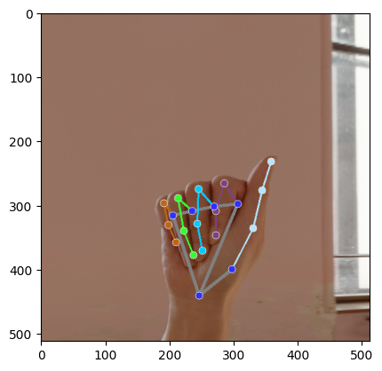

# ASL Interpreter

This workshop uses computer vision for sign-language classification. Students first extract hand landmarks with MediaPipe, then train models that classify hand signs from either landmarks or images.

## Notebooks

| Notebook | Use |
| --- | --- |
| [asl-interpreter-beginner.ipynb](asl-interpreter-beginner.ipynb) | Starter version with more scaffolding. |
| [asl-interpreter-intermediate.ipynb](asl-interpreter-intermediate.ipynb) | Main workshop version. |
| [asl-interpreter-advanced.ipynb](asl-interpreter-advanced.ipynb) | More independent implementation. |
| [asl-interpreter-solutions.ipynb](asl-interpreter-solutions.ipynb) | Completed reference notebook. |

## What Students Build

- An OpenCV image-loading and color-conversion pipeline.
- A MediaPipe hand-landmark extractor.
- A RandomForest classifier over normalized hand landmarks.
- A neural-network extension for classifying images directly.
- An inference function for testing a photo uploaded by the student.

## Run It

This workshop was designed for Kaggle.

1. Import one of the notebooks from GitHub.
2. Turn on internet access.
3. Attach the Kaggle dataset `synthetic-asl-alphabet`.
4. Run the notebook setup cell for MediaPipe and the other computer-vision dependencies.
5. For the inference section, upload a test image as a Kaggle dataset and update the path in the notebook.

## Credits

This notebook was created by Edinburgh AI for use in its workshops. If you reuse it, please credit Edinburgh AI.
