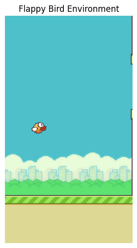

# Flappy Bird Reinforcement Learning

This workshop teaches reinforcement learning through a game environment. Students inspect the observation and action spaces, implement a DQN-style agent, and train it to play Flappy Bird.

## Notebooks And Files

| File | Use |
| --- | --- |
| [flappybird-all-the-one-level.ipynb](flappybird-all-the-one-level.ipynb) | Student-facing workshop notebook. |
| [flappybird-solutions.ipynb](flappybird-solutions.ipynb) | Completed reference notebook. |
| [best_flappy_model.pt](best_flappy_model.pt) | Saved model checkpoint from the workshop. |
| [requirements.txt](requirements.txt) | Package list used for this workshop. |

## What Students Build

- A Gymnasium environment for Flappy Bird.
- A small Q-network in PyTorch.
- Experience replay and epsilon-greedy exploration.
- A training loop that improves the policy through rewards.
- A visualization of the environment and learned agent behavior.

## Run It

This workshop was designed for Kaggle.

1. Import the notebook from GitHub.
2. Turn on internet access.
3. Run the dependency-install cell for `flappy-bird-gymnasium`, `gymnasium`, `torch`, `matplotlib`, and `tqdm`.
4. Run the notebook cells in order.

GPU is helpful for training, but the environment exploration sections can run without one.

## Credits

Created by Edinburgh AI for educational purposes. If you reuse it, please credit Edinburgh AI.
