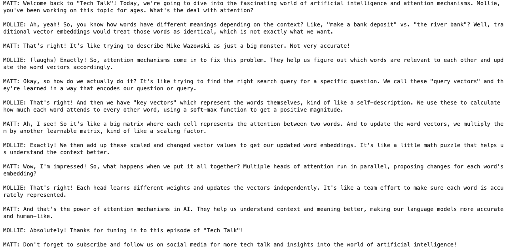

# Open Source AI Radio Show

This practical workshop is an earlier version of the notes-to-audio idea. Students build a local AI radio show over university notes using embeddings, vector search, a local LLM, and text-to-speech.

## Notebooks And Data

| Notebook | Use |
| --- | --- |
| [Locally-Awesome-AI-beginner.ipynb](Locally-Awesome-AI-beginner.ipynb) | Starter version with more scaffolding. |
| [Locally-Awesome-AI-intermediate.ipynb](Locally-Awesome-AI-intermediate.ipynb) | Main workshop version. |
| [Locally-Awesome-AI-advanced.ipynb](Locally-Awesome-AI-advanced.ipynb) | More independent implementation. |
| [locally-awesome-ai-solutions.ipynb](locally-awesome-ai-solutions.ipynb) | Completed reference notebook. |
| [data/notes_dataset.csv](data/notes_dataset.csv) | Notes dataset used for retrieval. |

## What Students Build

- A vector database over notes using sentence embeddings and FAISS.
- A retrieval-augmented prompt for answering questions.
- A two-host radio-style conversation using Ollama.
- Speech output using Kokoro TTS.

## Run It

This workshop was designed for Kaggle.

1. Import the beginner, intermediate, or advanced notebook from GitHub.
2. Turn on internet access.
3. Attach the Kaggle dataset named `EdinburghAI-Sem2-Workshop1-UniversityNotes`, or upload the CSV from [data](data).
4. Run the notebook setup cells for FAISS, Ollama, Kokoro, and `espeak-ng`.

## Credits

This notebook was created by Edinburgh AI for use in its workshops. If you reuse it, please credit Edinburgh AI.
