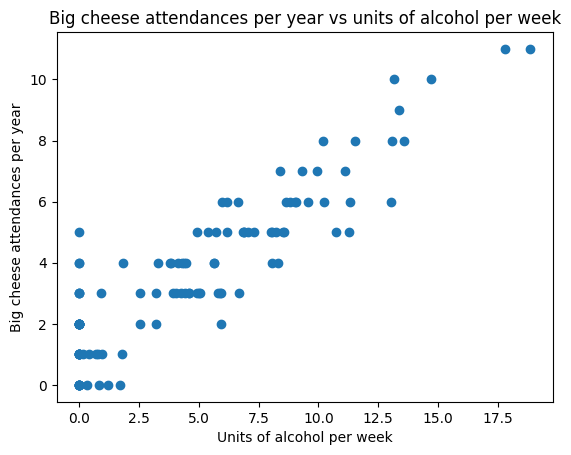
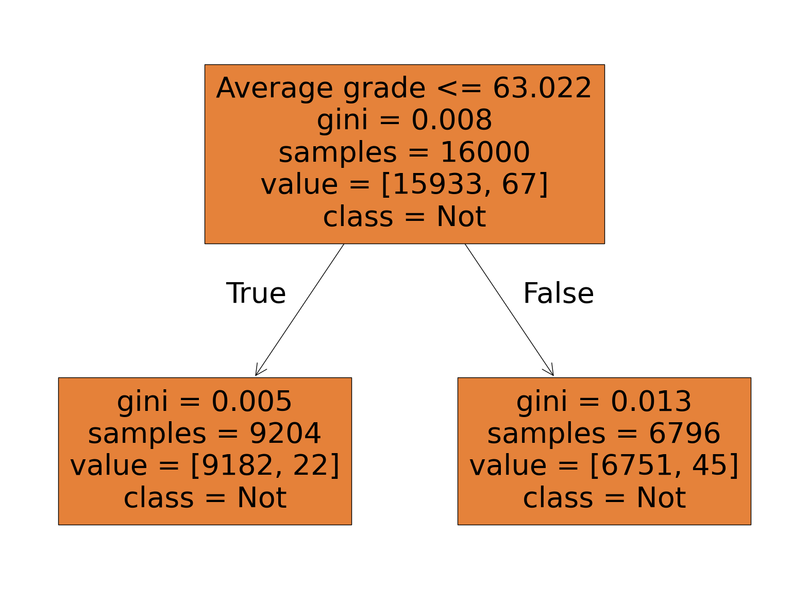

# Intro to Machine Learning

This first workshop introduces machine learning through small, visual examples. Students fit a line with linear regression, test how models behave outside the data they saw, and then move into decision trees for classification.

## Notebooks

| Notebook | Use |
| --- | --- |
| [IntroToML-Beginner.ipynb](IntroToML-Beginner.ipynb) | Starter version with more scaffolding. |
| [IntroToML-Intermediate.ipynb](IntroToML-Intermediate.ipynb) | Main workshop version. |
| [IntroToML-Expert.ipynb](IntroToML-Expert.ipynb) | More gaps and extension prompts. |
| [IntroToML-Solved.ipynb](IntroToML-Solved.ipynb) | Completed reference notebook. |

## What Students Build

- A linear-regression model over a deliberately fake student dataset.
- A polynomial feature version that shows how linear models can express curved relationships.
- A decision-tree classifier for a synthetic internship-selection problem.
- A discussion around why automated decision systems can be misleading even when they score well.

## Run It

This workshop was designed for Kaggle.

1. Import one of the notebooks from GitHub into Kaggle.
2. Add the dataset named `EdinburghAI-Workshop1`.
3. Run the cells from top to bottom.

The CSV files are also included locally in [data](data), so the notebook can be adapted to run outside Kaggle by changing the data path.

## Credits

This notebook was created by Edinburgh AI for use in its workshops. If you reuse it, please credit Edinburgh AI.
