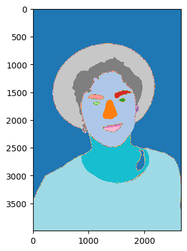

# Computer Vision With CNNs

This workshop teaches computer vision by starting with a single convolution and ending with a pretrained segmentation model. Students see how kernels respond to images, train a classifier, and then run semantic segmentation on a face image.

## Notebooks

| Notebook | Use |
| --- | --- |
| [CNNs.ipynb](CNNs.ipynb) | Student-facing workshop notebook. |
| [CNNs-Solved.ipynb](CNNs-Solved.ipynb) | Completed reference notebook. |

## What Students Build

- A visual convolution demo using hand-chosen kernels.
- A CNN classifier over image data.
- A model-evaluation section with confusion matrices and classification reports.
- A face-segmentation demo using a pretrained SegFormer model.

## Run It

This workshop was designed for Kaggle.

1. Import the notebook from GitHub.
2. Attach the UC Merced Land Use dataset when prompted.
3. Keep internet enabled for model downloads.
4. GPU is helpful but not required for the early convolution demos.

## Credits

This notebook was created by Edinburgh AI for use in its workshops. If you reuse it, please credit Edinburgh AI.
