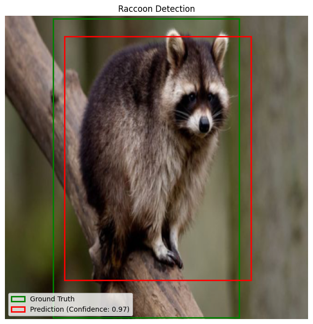

# Single-Object YOLO Detection

This workshop turns image classification into object detection. Students build the head of a single-object detector, define a bounding-box loss, train on an image dataset, and evaluate predictions using intersection over union.

## Notebooks And Support Files

| File | Use |
| --- | --- |
| [workshop-notebooks/unsolved-ediai-single-obj-detection.ipynb](workshop-notebooks/unsolved-ediai-single-obj-detection.ipynb) | Student-facing notebook. |
| [workshop-notebooks/solved-ediai-single-obj-detection-final.ipynb](workshop-notebooks/solved-ediai-single-obj-detection-final.ipynb) | Completed reference notebook. |
| [workshop-notebooks/ediai-single-obj-detection-solved-beta.ipynb](workshop-notebooks/ediai-single-obj-detection-solved-beta.ipynb) | Earlier solved beta notebook kept for reference. |
| [yolo-workshop-api](yolo-workshop-api) | Helper code and extra notes used by the notebooks. |
| [yolo-workshop-api/single-obj-yolo-presentation.pptx](yolo-workshop-api/single-obj-yolo-presentation.pptx) | Presentation deck for the session. |

## What Students Build

- Data-wrangling code that normalizes bounding-box coordinates.
- A PyTorch model head on top of a provided convolutional backbone.
- A custom weighted loss over confidence and box coordinates.
- IoU-based evaluation and visual inspection of predicted boxes.

## Run It

This workshop was designed for Kaggle.

1. Import the unsolved notebook from GitHub.
2. Attach the Kaggle dataset [Raccoon Dataset](https://www.kaggle.com/datasets/debasisdotcom/racoon-detection).
3. Turn on internet access so the notebook can fetch the helper files from this repo.
4. Enable a GPU for the training section.
5. Run the notebook from top to bottom.

## Credits

Created for Edinburgh AI workshops. Please credit Edinburgh AI if you reuse or adapt the material.
